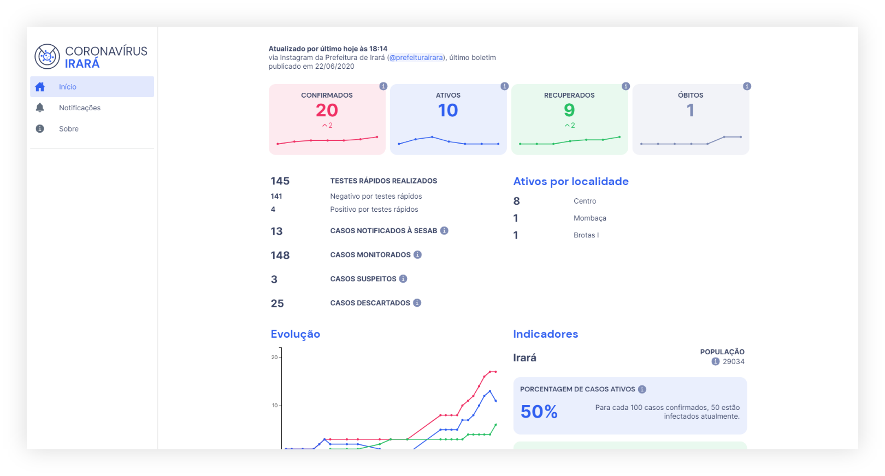

# 

Plataforma para acompanhamento do novo Coronavírus (COVID-19) na cidade de Irará/BA.

_Este repositório agora contém apenas o dashboard. Se está em busca dos outros projetos que estavam disponíveis anteriormente aqui, visite a [página do COVID-19 Municipal no GitHub](https://github.com/covidmunicipal)._

Sinta-se livre para contribuir com o projeto e adaptá-lo para outros propósitos! ❤

## Download de dados

Se está em busca dos dados coletados sobre o Coronavírus em Irará, acesse a [planilha do Google Sheets](https://docs.google.com/spreadsheets/d/1-a543uhVSRItc7P4tZPiHBvz5bwUH0zQLn5b8hNbehg). Você também pode obter um arquivo `.json` na [seção Sobre da plataforma de acompanhamento](https://covid.riso.dev/about), selecionando a opção _Acesse o banco de dados_. Os dados da Secretaria de Saúde da Bahia (SESAB) podem ser visualizados no [Brasil.IO](https://brasil.io/covid19/BA/).

## Configurando

Clone o repositório para um diretório da sua preferência.

O projeto requer o [Node.js](https://nodejs.org) v10 ou posterior.

Instale os CLIs do Ionic e do Angular:

    npm install -g @ionic/cli
    npm install -g @angular/cli

Instale as dependências do projeto:

    npm install

## Executando no navegador

Dentro da pasta raiz do repositório, execute:

    ionic serve

Uma página abrirá no navegador padrão com o app.

## Google Analytics

Este projeto tem integração com o [Google Analytics](https://analytics.google.com), e pode coletar certas informações como descrito [nessa página](https://support.google.com/analytics/answer/6318039). Caso deseje desativar essa integração, remova a importação do `AngularFireAnalyticsModule` e as referências relacionadas no arquivo `app.module.ts`.

## [Contribuidores] Implantando uma nova versão

Para implantar uma nova versão no Firebase, certifique-se de que o último commit satisfaz aos testes.

Primeiro, altere o atributo `version` no arquivo `package.json` com o novo número de versão e realize commit desta alteração normalmente.

Depois, realize um pull request para a branch `release`.

Quando o pull request for aceito, o deploy será feito automaticamente para o projeto `covid19-municipal` (covid.riso.dev) no Firebase.

## Sobre

Este projeto é mantido com muito carinho por [Erick Almeida](https://github.com/erick2280), [Diego Silva](https://github.com/di3goCS) e [contribuidores](https://github.com/orgs/covidmunicipal/people).

O projeto foi inspirado no [covid19india](https://github.com/covid19india) e no [covid19japan](https://github.com/reustle/covid19japan). Além dos dados coletados pelo projeto, também utilizamos os dados disponibilizados pelo projeto [Brasil.IO](https://brasil.io/).
